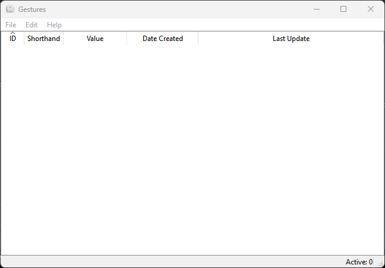

 **Gestures**
---
_Gestures_ is a desktop application that can programmatically typed custom or commonly used abbreviations.

Downloads
---

| Version      | Release date | Platform             |
|--------------|--------------|----------------------|
| Gestures 2.0 | 1 Sep 2022   | Windows 10/11 64-bit |

Feature(s) and Benefits
---
* Automatically typed commonly used strings such as passwords, emails, numbers, etc.

Usage
---
**Adding a gesture**
1. Go to **File** menu and select **New (Ctrl+N)** sub-menu 
2. In the _Add Gesture_ dialog, fill out the **Shorthand** and **Value** text fields
3. Press the **OK** button

To use a gesture, put your cursor to a text editor or any text field wherein you can type. Then, typed the **Shorthand** + `space` key immediately. The **Value** of that Shorthand will be automatically typed-written. 

**Updating a gesture**
1. Select a row you want to update in the table
2. Go to **Edit** menu and select **Update** sub-menu
3. In the _Update Gesture_ dialog, update either the Shorthand or Value field that you want to change
4. Press the **OK** button

**Removing a gesture**
1. Select a row you want to remove in the table
2. Go to **Edit** menu and select **Delete** sub-menu
3. In the _Delete Gesture_ dialog, click **Yes** if you want to proceed, and **No** if you want to cancel

Software Requirements
---
- Python [3.9.x](https://www.python.org/downloads/)
- [PyQt5](https://pypi.org/project/PyQt5/)
- [keyboard](https://pypi.org/project/keyboard/)
- [Pipenv](https://pypi.org/project/pipenv/)
- [PyInstaller](https://pypi.org/project/pyinstaller/)

System Requirements
---
- OS: Windows 10/11 64-bit

Credits
---
* Arnaud Nelissen aka [Chromatix](http://www.iconarchive.com/artist/chromatix.html) for the beautiful icon use by Gestures
* [keyboard](https://github.com/boppreh/keyboard) the core library that inspired me to create Gestures
