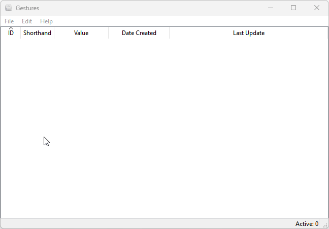

 **Gestures**
---
_Gestures_ is a desktop application that can programmatically typed custom or commonly used abbreviations.

Feature(s) and Benefits
---
* Automatically typed commonly used strings such as passwords, emails, numbers, etc.

Usage
---
***Adding a gesture***
1. Go to **File** menu and select **New (Ctrl+N)** sub-menu 
2. In the _Add Gesture_ dialog, fill out the **Shorthand** and **Value** text fields
3. Press the **OK** button

To use a gesture, put your cursor to a text editor or any text field wherein you can type. Then, typed the `Shorthand` + `space` key and the `Value` of that Shorthand will be automatically typed-written. 

***Updating a gesture***

There are two ways to update a gesture via double-clicking the cell or using the `Update` button:

_Via double-click_
1. Double-click the cell you want to update either gesture or meaning.
2. Press `Enter` to accept your amendments.

_Via `Update` button_
1. Press the `Update` button.
2. Type the gesture and its new meaning, then hit OK.

Note: The `Update` button will only update the meaning of the gesture. If you want to update the gesture, use the first method.  

***Removing a gesture***
1. Click on the row you want to remove.
2. Press the `Remove` button and it will be remove instantly.

Software Requirements
---
- Python [3.9.x](https://www.python.org/downloads/)
- [PyQt5](https://pypi.org/project/PyQt5/)
- [keyboard](https://pypi.org/project/keyboard/)
- [Pipenv](https://pypi.org/project/pipenv/)
- [PyInstaller](https://pypi.org/project/pyinstaller/)

System Requirements
---
- Operating System: Windows 10/11 64-bit

Credits
---
* Arnaud Nelissen aka [Chromatix](http://www.iconarchive.com/artist/chromatix.html) for the beautiful icon use by Gestures
* [keyboard](https://github.com/boppreh/keyboard) the core library that inspired me to create Gestures
